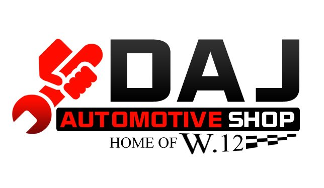

# GLADIATOR

**A website project for DAJ Auto Repair Shop**

---

##  MEMBERS
- **Brylle Banquil**
- **Jinfilman Nacilla**
- **Rob Dustin Galeos**
- **Gilbert Saut**
- **James Gilbert Duran**

---

## PROJECT OVERVIEW
This project is created as a website for **DAJ Auto Repair Shop**, providing online visibility and information for the business including services, contact details, and a dashboard for management.

---

##  DAJ AUTO REPAIR SHOP
**Official Facebook Page:**  
[Visit Facebook](https://www.facebook.com/aelihk)

**Data Reference:**  
[Visit Link](https://www.cebuad.com/car-repair/daj-auto-repair-shop.html)

---

##  PROJECT STRUCTURE
GLADIATOR/
│
├── src/
│   ├── DAJ.jpg
│   ├── car-repair.png
│   └── contact-us.jpg
│
├── Add-Services.css
├── Add-Services.html
├── dashboard.css
├── dashboard.html
├── index.html
├── login.css
├── login.html
├── register.css
├── register.html
├── style.css
└── README.md

---

##  PROJECT IMAGES

###  DAJ Auto Repair Shop Logo

### Car Repair Section

### Contact Us Page

---

## TECHNOLOGIES USED
- **HTML5** – Structure  
- **CSS3** – Styling and Layout  
- **VS Code** – Development Environment  

---

## VERSION CONTROL
All project files are managed using **Git** and hosted on **GitHub** for collaboration and version tracking.

---

## LICENSE
This project is created for educational purposes only and is not for commercial use.